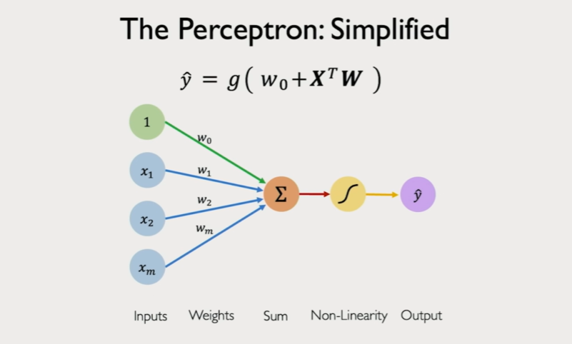
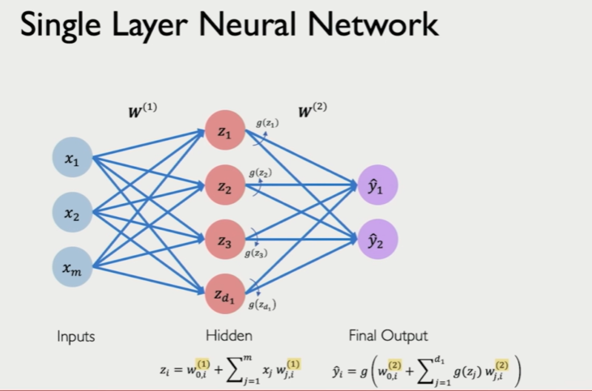
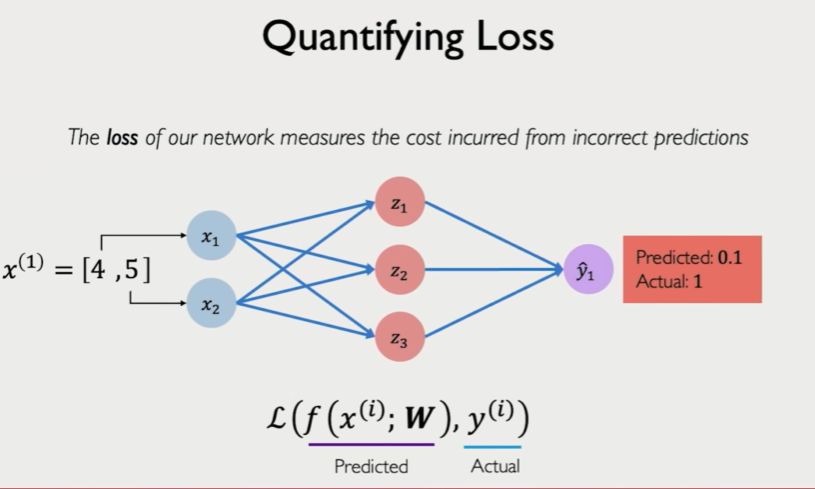
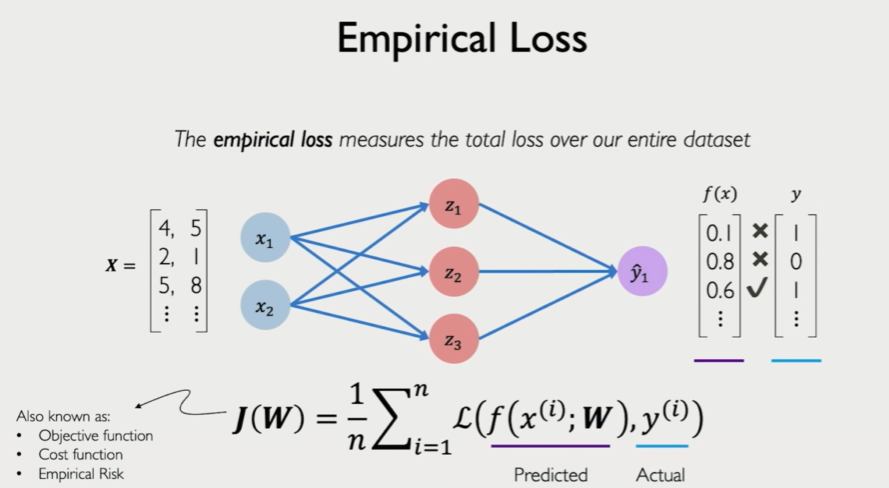
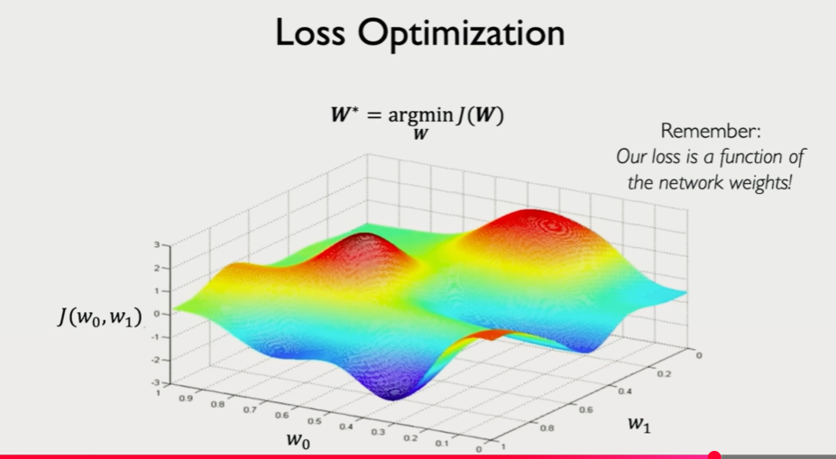
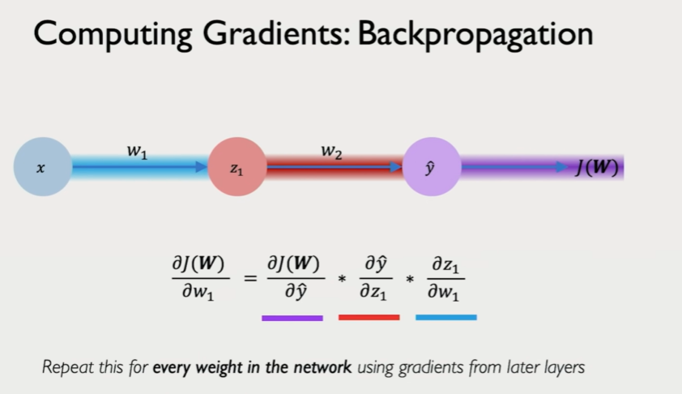
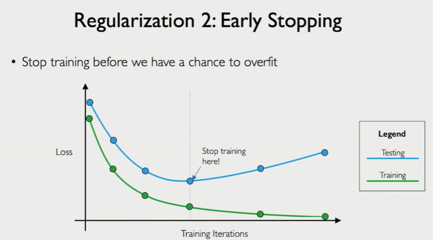

# basic structure and forward pass funcs

# Loss

## Binary Cross Entropy Loss

_Cross entropy loss_ can be used with models that output a probability between 0 and 1.

$$J(\boldsymbol{W}) = -\frac{1}{n} \sum_{i=1}^{n} \underbrace{y^{(i)}}_{\text{Actual}} \log(\underbrace{f(x^{(i)}; \boldsymbol{W})}_{\text{Predicted}}) + (1 - \underbrace{y^{(i)}}_{\text{Actual}}) \log(1 - \underbrace{f(x^{(i)}; \boldsymbol{W})}_{\text{Predicted}})$$

---

## Mean Squared Error Loss

_Mean squared error loss_ can be used with regression models that output continuous real numbers.

$$J(\boldsymbol{W}) = \frac{1}{n} \sum_{i=1}^{n} (\underbrace{y^{(i)}}_{\text{Actual}} - \underbrace{f(x^{(i)}; \boldsymbol{W})}_{\text{Predicted}})^2$$

---

### Quick Comparison for Notes:

|**Loss Function**|**Use Case**|**Output Type**|
|---|---|---|
|**Binary Cross Entropy**|Classification|Probabilities $[0, 1]$|
|**Mean Squared Error**|Regression|Continuous values (e.g., percentages, prices)|
# Training NNs
### Loss Optimization

We want to find the network weights that **achieve the lowest loss**

$$W^* = \arg\min_{\boldsymbol{W}} \frac{1}{n} \sum_{i=1}^{n} \mathcal{L}(f(x^{(i)}; \boldsymbol{W}), y^{(i)})$$

$$W^* = \arg\min_{\boldsymbol{W}} J(\boldsymbol{W})$$

### Algorithm for gradient descent

1. Initialize weights randomly $\sim \mathcal{N}(0, \sigma^2)$
    
2. **Loop until convergence:**
    
3. $\quad$ Compute gradient, $\frac{\partial J(\boldsymbol{W})}{\partial \boldsymbol{W}}$
    
4. $\quad$ Update weights, $\boldsymbol{W} \leftarrow \boldsymbol{W} - \eta \frac{\partial J(\boldsymbol{W})}{\partial \boldsymbol{W}}$
    
5. Return weights

- the derivate value $\frac{\partial J(\boldsymbol{W})}{\partial \boldsymbol{W}}$ is calculated by applying chain rule and its value will be calculated to different levels based on which weights we are updating. Each path from output variable to input variable should have this calculation.
- 

**$\eta$ (Eta)**: The **learning rate**, which determines the size of the step taken toward the minimum.

- we are able to do above chain rule as each output only depends on previous weights 

### Learning rates types
- constant
- exponential decay
- Adaptive Learning Rate
	- SGD
	- Adam
	- Adagrad
	- RMSProp

### Stochastic Gradient Descent (Single Data Point)

### Algorithm

1. Initialize weights randomly $\sim \mathcal{N}(0, \sigma^2)$
    
2. **Loop until convergence:**
    
3. $\quad$ Pick single data point $i$
    
4. $\quad$ Compute gradient, $\frac{\partial J_i(\boldsymbol{W})}{\partial \boldsymbol{W}}$
    
5. $\quad$ Update weights, $\boldsymbol{W} \leftarrow \boldsymbol{W} - \eta \frac{\partial J(\boldsymbol{W})}{\partial \boldsymbol{W}}$
    
6. Return weights
    

---

### Stochastic Gradient Descent (Mini-batch)

- allow use of gpus to parallelize within batch computation 

### Algorithm

1. Initialize weights randomly $\sim \mathcal{N}(0, \sigma^2)$
    
2. **Loop until convergence:**
    
3. $\quad$ Pick batch of $B$ data points
    
4. $\quad$ Compute gradient, $\frac{\partial J(\boldsymbol{W})}{\partial \boldsymbol{W}} = \frac{1}{B} \sum_{k=1}^{B} \frac{\partial J_k(\boldsymbol{W})}{\partial \boldsymbol{W}}$
    
5. $\quad$ Update weights, $\boldsymbol{W} \leftarrow \boldsymbol{W} - \eta \frac{\partial J(\boldsymbol{W})}{\partial \boldsymbol{W}}$
    
6. Return weights

### Overfitting resolutions

- Dropout
	- Randomly set a percentage of neuron outputs as 0 . This random selection changes in every pass
- Early Stopping

