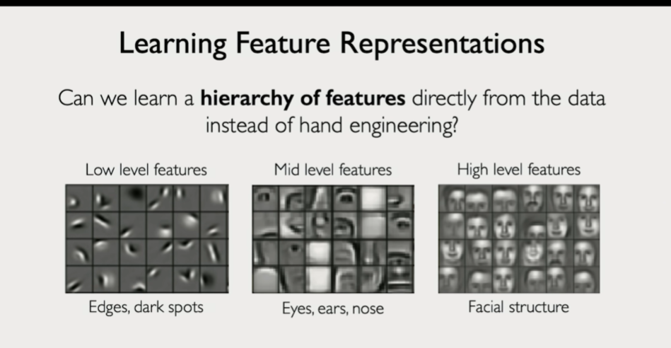
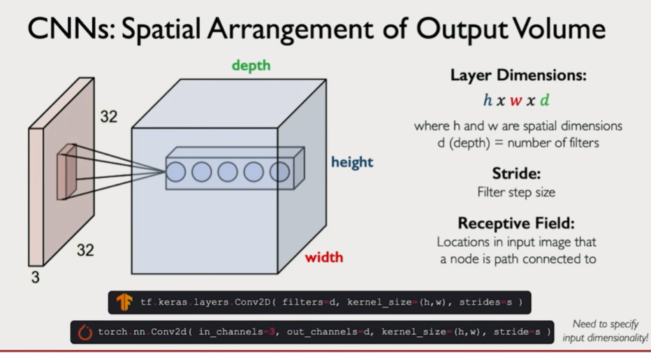
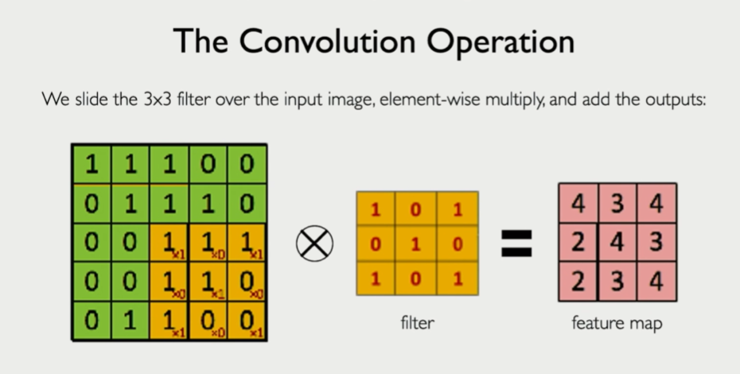
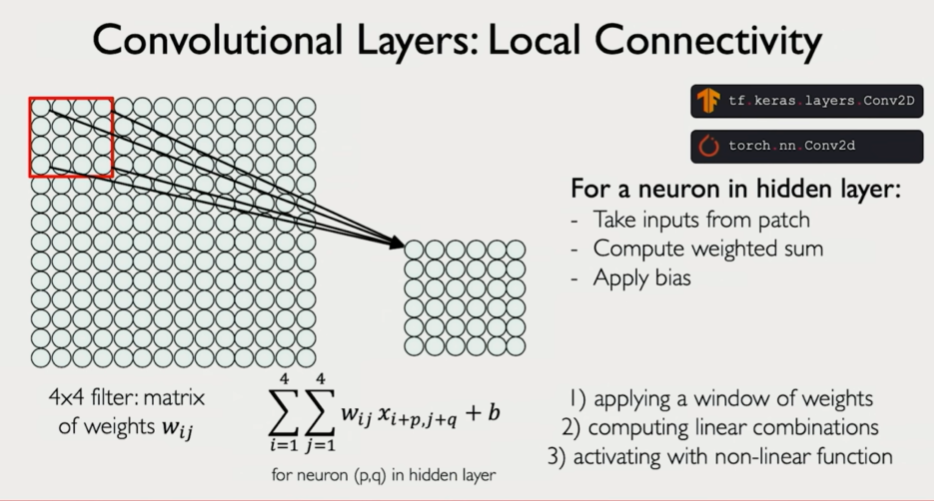
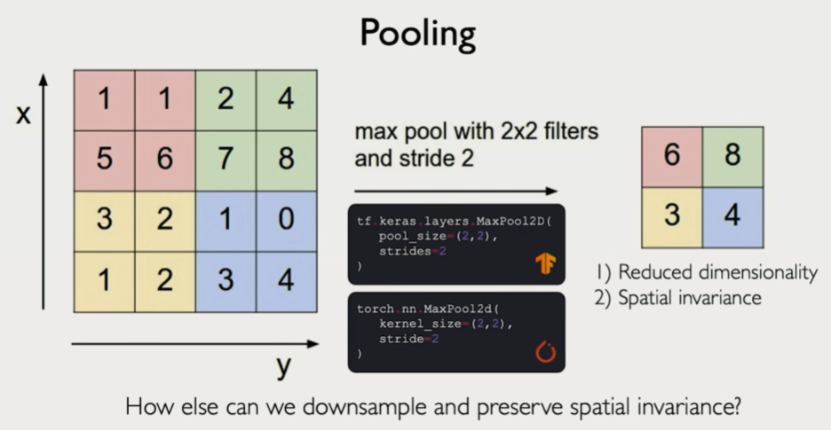
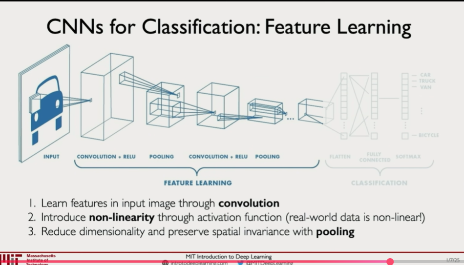
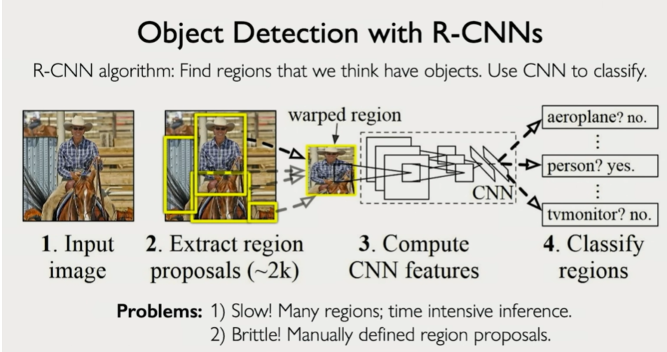
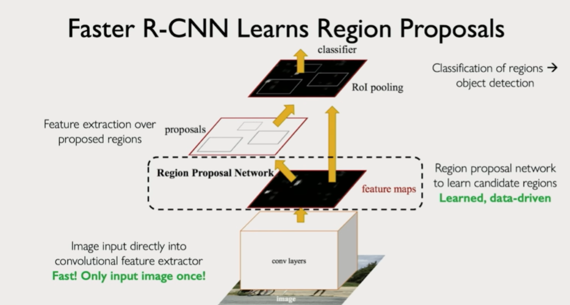
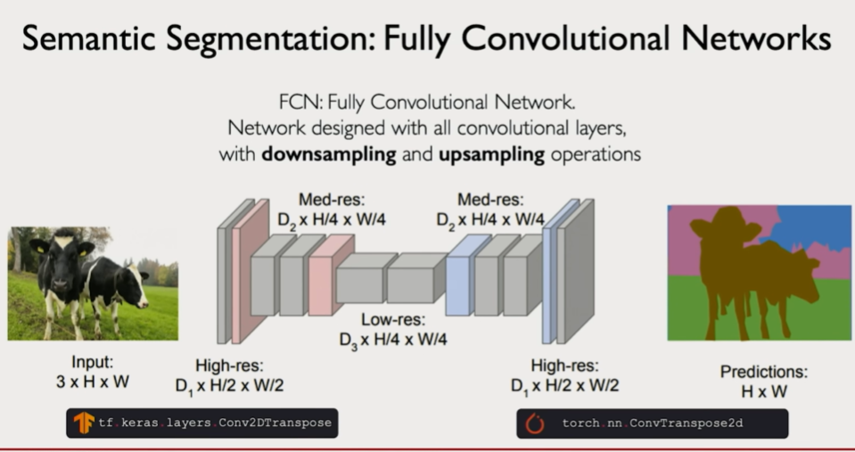

- Used in various image related tasks 
- using ML for image tasks is tedious as features need to be human defined but this is not the case for DL models

### intro points

- different layers in the DL model learn different features. 
- Deeper layers learn more high level features . Reason : receptive field size increase
- having a NN for image ( 2d ) input is bad as 
	- input needs to be flattened so we loose spatial information
	- network size increases 

### CNN basic terms and operations
1. filter vs kernel
	- kernel is 2d
	- filter can be 3d . It is a set of kernels applied on image . the channels ( depth) should match that of image
	- in Conv NN we sometimes use multiple filters in one layer . This increases channels in layer output

2. Convolution

- filter values can be hand engineered or learned through backprop

3. Pooling

- pooling is done after convolution . So that the feature map size decreases this increases receptive field size for next convolution layer

4. receptive field
	- global receptive field is the part of the og input image seen by the current convolution layer. It keeps increasing in size as we add more layers. we can also do pooling , have high strides to increase receptive field

5. Stride
	- speed at which filter moves . No. of columns we skip while moving filter over image

6. Spatial invariance
	- same filter being used across image means translation equivariance in the feature . Feature can be on any part of the image and get captured
	- **Conv layer provides for equivariance . Pooling provides for Invariance**
	- CNN are not immune to rotation, point of view Invariance and need to be explicity trained for it
7. Deconv or Transpose conv
	- opposite of conv 
8. Uppooling
	- opposite of pooling

**NOTE:**
- in CNN we usually apply filter with many kernels at each level. We also keep reducing image height, width ( depth increases due to filter depth). This helps capture multiple useful high level featues from input image. At the same time we loose out information on where these features are actually located in input image ( What vs Where tradeoff )

### CNN use cases

1. Classification use case
	- the feature learning part remains constant just the last part changes

2. Object Detection

3. Segmentation

How deconv actually works ???
how uppooling actually works ???
update in respective sections

