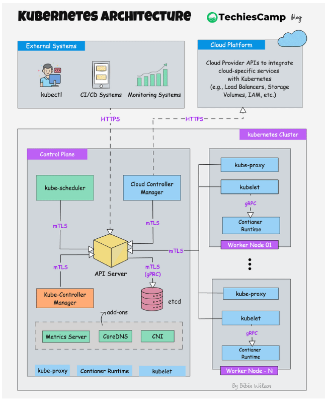
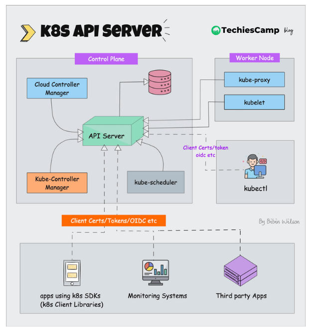
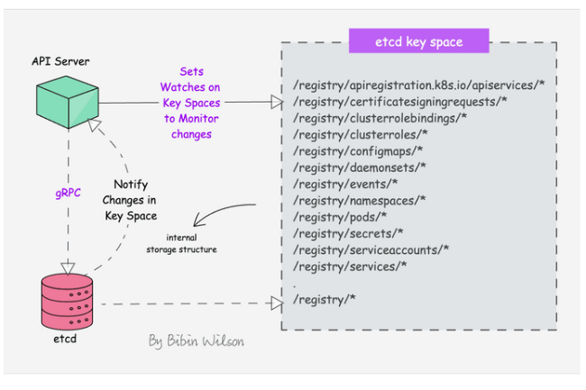
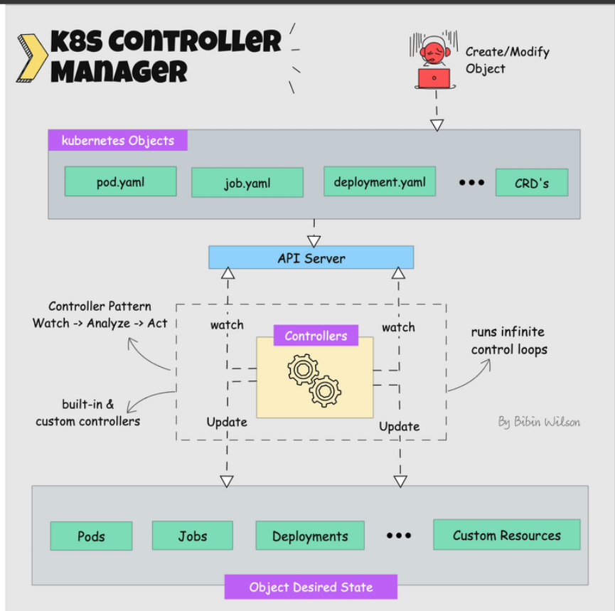
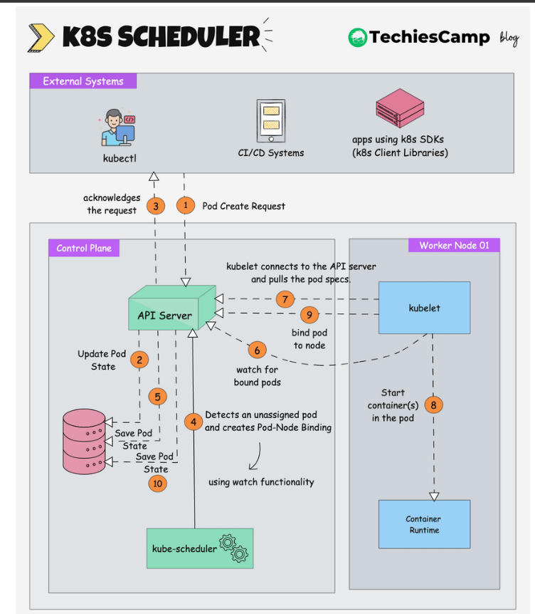
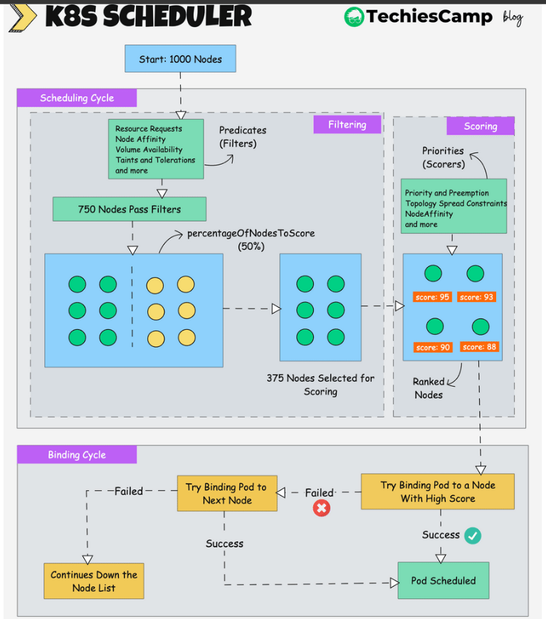
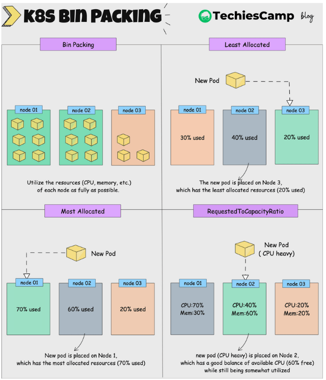
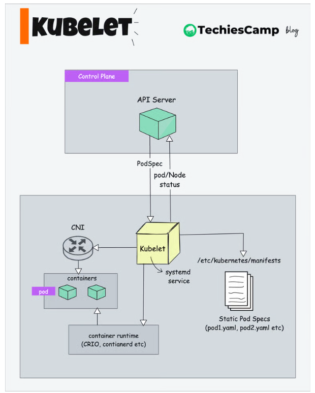
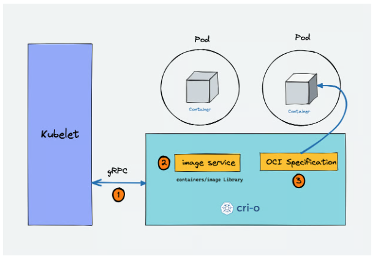
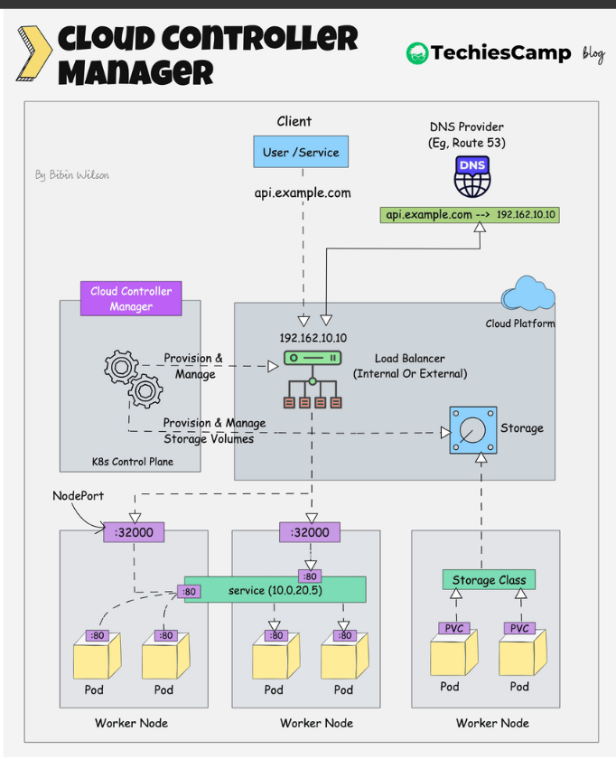

Every explanation of Kubernetes architecture opens with the same picture. Ten boxes. Control plane on the left, worker nodes on the right, arrows in between. I stared at that diagram for a long time before any of it stuck, and I've come to think the diagram is part of the problem.

The trouble is the arrows. They look like calls. They suggest the scheduler picks up the phone to the kubelet, that the controller manager tells the scheduler there's work to do, that there's some orderly chain of command running down the page.

There isn't. Almost nothing in Kubernetes talks to anything else.

With one exception, every component in that diagram talks to exactly one other component — the API server — and it does so by opening a long-lived HTTP connection and then waiting to be told that something it cares about has changed. The scheduler never calls the kubelet. The deployment controller never calls the scheduler. They don't know each other exists.

Once that lands, the diagram stops being a network and becomes something much simpler: a list of loops, all pointed at the same place.

The best way I know to show this is to follow one `kubectl apply` all the way from your terminal to a running container, and introduce each component at the moment it actually does something.

## The write

You run `kubectl apply -f deployment.yaml`. The first thing that happens is an HTTP request to the API server, and the first thing the API server does is decide whether it's going to listen to you at all.

Authentication comes first, and inside a cluster it's almost always certificates — each component gets a client cert, and the API server checks it. Then authorisation, which is RBAC: Roles that describe what may be done, RoleBindings that attach them to a subject. Only after both of those does the API server look at what you actually sent.

There's also versioning to get through — `v1`, `v1beta1`, and so on — because the API server has to accept objects written against older versions of the schema and store them in whatever the current internal representation is. This is unglamorous and it's most of what an API server does.

And then it writes to etcd.

That last sentence is worth slowing down on, because it's the load-bearing fact of the whole architecture: **the API server is the only component that talks to etcd.** Not the scheduler. Not the controller manager. Not the kubelet. If some component needs to know the state of the world, it asks the API server, and the API server asks etcd.

You could imagine a design where every component read from the datastore directly. It would even be faster. But then every component would need etcd credentials, would need to understand etcd's data layout, and would be able to write whatever it liked. Funnelling everything through one process means authentication, authorisation, validation, and versioning happen in exactly one place. The cost is a bottleneck. The benefit is that there is one door.

## etcd, briefly

etcd is a strongly consistent distributed key-value store, and it uses Raft to stay that way. One node is the leader and all writes go through it; the write isn't committed until a quorum of nodes has acknowledged it. That quorum requirement is where the cluster's fault tolerance comes from, and it's also why etcd cluster sizes are always odd numbers.

Underneath, etcd stores data in bbolt. Above that, it's multi-version — an update doesn't overwrite the old value, it writes a new revision alongside it. That's what makes the watch API possible, which we'll get to shortly, and it's genuinely useful: you can ask what the state was at revision *n*.

It also means etcd accumulates history forever unless something removes it, which is why compaction exists, and why defragmentation exists after that. Compaction drops old revisions; defragmentation reclaims the space they left behind in the file. My notes describe this as a frequent operational need, and I'll leave it there rather than pretend to more operational scar tissue than I have.

So: your Deployment object is now durably stored, and the API server returns a `201` to `kubectl`. From your terminal's point of view, the job is done.

Nothing is running yet. No container has been pulled. No node has been chosen. All that exists is a record of intent.

## The watch

Here's the mechanism everything else hangs off.

A component that cares about some kind of object — Deployments, say, or Pods — opens a long-lived HTTP connection to the API server and says, in effect, *tell me when one of these changes*. The API server holds the connection open and streams events down it: ADDED, MODIFIED, DELETED. No polling. No component asking another component whether there's work.

This is the watch API, and once you know it's there, the architecture diagram's arrows all resolve into the same shape. Every box is a program in a loop: watch for events, compare what the cluster looks like to what it's supposed to look like, do something about the difference, repeat.

That pattern has a name — the reconciliation loop — and it's the reason Kubernetes recovers from things. A controller isn't executing a plan that could get interrupted halfway. It's continuously asking *is reality what it should be?* and acting when the answer is no. Kill a controller mid-operation and restart it, and it picks up from whatever state it finds.

## The controllers

The controller manager is one process. Inside it, one goroutine per controller — Deployment, Job, CronJob, and a long list of others — each with its own watch on the API server, each reconciling its own kind of object.

The Deployment controller sees the ADDED event for the object you just created. It compares what exists against what your spec asked for, finds no pods, and creates them — through the API server, of course, which writes them to etcd, which produces more events, which other controllers are watching for.

Notice what didn't happen: the Deployment controller did not choose a node. The pods it created have no node assigned to them at all. They exist as records with an empty `nodeName` field. As far as the cluster is concerned they're wishes, not workloads.

That's deliberate. Deciding *what should exist* and deciding *where it should go* are different problems, and Kubernetes keeps them in different processes.

## The scheduler

The scheduler is watching for exactly one thing: pods with no node assigned.

When it finds one, it has to answer a question that sounds simple and isn't — which node should this run on?

The answer comes in two stages. First, filtering: eliminate every node that *can't* run this pod. Not enough CPU or memory, taints the pod doesn't tolerate, node selectors that don't match, and so on. What survives is the set of feasible nodes. Then, scoring: rank the survivors and take the best one.

The scoring stage is where it gets opinionated, because "best" is a policy question rather than a technical one.

The default is **Least Allocated** — prefer the node with the most free resources. Spread things out. It's a sensible default because it gives every pod room to grow and limits the blast radius when a node dies.

The alternatives lean the other way. **Most Allocated** prefers the node that's already busiest, which packs workloads tightly onto fewer nodes and leaves others empty — bin packing, and exactly what you want if a cluster autoscaler is going to turn those empty nodes off and stop charging you for them. **Requested to Capacity Ratio** is the more nuanced version: it looks at the ratio of requested to available resources across several dimensions rather than treating CPU and memory as one number.

Whichever wins, the scheduler's output is anticlimactic. It doesn't launch anything. It writes the node's name into the pod object — through the API server, which writes to etcd, which emits another event.

The scheduler's entire job is to fill in one field.

## The kubelet

On every node there's a kubelet, watching the API server for pods assigned to *its* node. Your pod's `nodeName` just changed to match. The kubelet's watch fires.

This is the first component in the whole sequence that touches anything real.

It doesn't run containers itself. It talks to a container runtime over the Container Runtime Interface, and that indirection is the point — it's what let the ecosystem move off Docker to containerd and CRI-O without rewriting the kubelet.

Before the container can run, though, the kubelet has to build the world around it. It calls out to the CNI plugin to allocate a pod IP, create the network namespace, and configure the interface. It writes the cluster DNS server address into the pod's `/etc/resolv.conf`, along with the search domains that make `my-service` resolve without anyone typing the full name. It mounts volumes. It pulls any Secrets and ConfigMaps the pod references — again by watching the API server — and mounts those too, and keeps watching, so that when a ConfigMap changes the mounted copy updates.

Then the container starts, and the kubelet's job shifts from creation to supervision. Liveness probes: is this still working, and should I restart it? Readiness probes: should this receive traffic yet? It reports node health and status back to the control plane continuously, which is how the cluster notices a node has died.

It also reports metrics, and the split there is worth knowing. Node-level numbers come straight from the operating system. Container-level numbers come from cAdvisor, which runs *inside* the kubelet rather than as a separate thing. The metrics server that `kubectl top` talks to is an add-on that queries every kubelet in turn.

One more piece of kubelet trivia that turns out to matter: **static pods**. These are pods the kubelet runs from a local file, with no involvement from the API server at all. Which raises an obvious chicken-and-egg question — how does the API server itself get started, when starting things requires an API server? Static pods are the answer. The control plane is bootstrapped by kubelets reading manifests off local disk.

## Reaching it

Your container is running and has an IP. That IP is useless to anyone, because it's ephemeral and nobody knows it.

Two things fix that.

**CoreDNS** answers names. It resolves `*.svc.cluster.local` to Service IPs, which is what lets one pod address another by name instead of by address. It does some basic load balancing of its own. And it forwards anything it isn't authoritative for — `google.com` — to an upstream resolver.

There's a special case worth knowing: if a Service is declared headless, with `clusterIP: None`, CoreDNS skips the Service IP entirely and hands back pod IPs directly. Stateful workloads need this, because "any one of these replicas" is exactly the wrong answer when you're trying to reach a specific database member.

**kube-proxy** turns a Service IP into a pod IP. It runs on every node and programs iptables rules so that traffic to a Service IP gets rewritten to one of the backing pods. It works at L4, and its load balancing is *random* — there's no round robin, no least-connections, no awareness of how loaded anything is.

Which is a real limitation, and the ecosystem has largely routed around it. Ingress controllers like NGINX, and gateways like Envoy, skip kube-proxy altogether and send traffic straight to pod IPs. That's how you get session stickiness, retries, circuit breaking, and traffic splitting — none of which iptables can express.

## The one that talks to something else

I said there was an exception to everything-only-talks-to-the-API-server, and this is it.

The cloud controller manager is the component that talks to your cloud provider. It's split out from the main controller manager precisely because it's the part that isn't portable — everything else in the control plane is the same on AWS, GCP, and a laptop; this bit isn't.

Its node controller labels VMs with cloud metadata and handles nodes joining and leaving as instances come and go. Its service controller is the one that makes `type: LoadBalancer` mean something — you create a Service, and it goes and provisions an actual cloud load balancer. There's also a route controller for older networking setups, largely deprecated now.

Storage is the interesting omission. You'd expect volume provisioning here, and it isn't — it moved out to CSI drivers. You create a PersistentVolumeClaim, a CSI driver notices, provisions the real disk, and creates the PersistentVolume that binds to your claim. Same reconciliation pattern, separate component.

## What the diagram should have shown

Walk back through what actually happened. `kubectl` wrote an object. The API server validated it and put it in etcd. The Deployment controller noticed and created pods with no home. The scheduler noticed those and filled in a field. The kubelet noticed that field and built a container. kube-proxy and CoreDNS made it reachable.

Six components. Not one of them called another. Each one watched the API server, saw something it cared about, changed one thing, and wrote the result back — where it became the next component's input.

That's the whole architecture. It's a shared whiteboard with a lot of people staring at it, and the arrows in the diagram aren't calls at all — they're just everyone looking at the same board.

It also explains the failure modes. When something in a Kubernetes cluster doesn't happen, the question is almost never "which component failed to call which". It's "which loop isn't running, or is running and doesn't like what it sees". A pod stuck in `Pending` means the scheduler looked and found nothing feasible. A pod stuck in `ContainerCreating` means the kubelet took ownership and something underneath it — CNI, a volume, an image pull — hasn't finished.

The component you need is whichever one owns the field that isn't getting filled in.

## Sources

The architecture diagrams throughout this post are by **Bibin Wilson**, from
[Kubernetes Architecture](https://blog.techiescamp.com/docs/kubernetes-architecture/) on the
[TechiesCamp blog](https://blog.techiescamp.com/author/bibin/). They're the clearest set I've
found for this material, which is why I learned from them in the first place.

The scheduling and reconciliation behaviour described above comes from my own notes taken while
working through Kubernetes internals; any errors in the prose are mine, not his.

