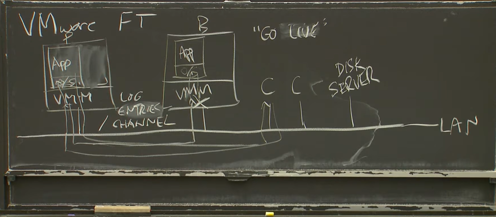

Replication
- helps with fail stop failures
- Does not help with software and hardware design bugs

State Transfer
- entire RAM contents transferred to replica
- high bandwidth operation 

Replicated State Machine
- operations done by primary passed onto replica 
- NOTE: they must yield same output 
- low bandwidth

### VMWare FT

**Rough Flow**
- A is master , B is replica. 
- C is client
- A constantly streams Log entries via channel to B. if B does not receive these for sometome then VMM ( Virtual Machine Monitor) makes B the master
- request flow: C sends request to A ( only A not B , reqs to B are routed to A) . A sends a response to C and also forwards the same request to B
- when A fails then B ( the VMM in B) notices this and does a "go live" makes B the master

**Log entry format**
- instruction number 
- type
- data

**Log channel communication**
- master has hardware clock which ticks multiple times every second. VMM takes this as in interrupt to guest OS . which then sends instruction logs. these are sent to B
- B hardware also generates clock signals but are ignored. VMM in B gets these logs from A and then special CPU architecture + rules + VMM are used to ensure that time, instruction number are changed to ensure that the incoming instructions from A are executed the exact same way 
- B cannot get ahead of A interms of instruction execution as it keeps a buffer of log events from A and uses it to stop its execution if some instructions from A need to be executed before proceeding

**Problematic events**
- Interrupts: interrupt occurs when external data packet arrives. NIC catches it and uses DMA to write to memory. Then processor at some point picks up these instructions
**Soln**: master sends instruction number it assigns to the interrupt to B

- Weird instructions : like get time, date, generate random number
**Soln**: master sends the instruction and output to B

- multicore : **Soln**: only allow unicore !

- case: A receives request from C( increment counter 10 by 1) , sends to B but due to network issue B does not get it. So B thinks A is dead and becomes master. Meanwhile A updates state to 11 and sends update to C. 
**Soln**: Use *Output Rule* -> when A receives req , A does not update state first but sends the req to B via log channel, now A updates state. Once A receives Ack from B then it sends the response to C

- Split Brain scenario occurs,  both A, B not able to communicate with each other"
**Soln**: Use a separate server using a test-and-set lock , only A or B can acquire it to resolve Split Brain

